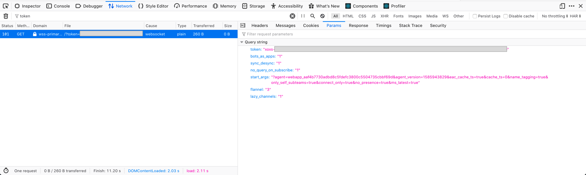
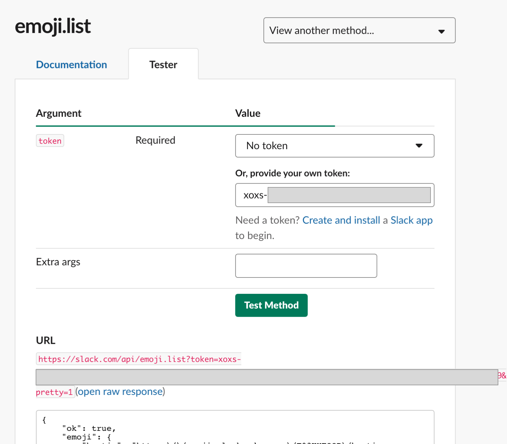
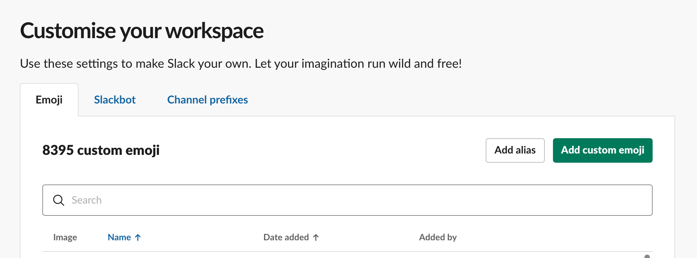

I recently wanted to grab around 8,000 emojis from one instance of Slack and add them into a second instance of Slack.

To achieve this, I pieced together various old sets of instructions across the web with varying degrees of success. Here's the final process that what worked for me, and the low quality code I wrote to make it happen.

### Step 1: Extract the emojis

I found a bunch of places suggesting that using an extension to download all page resources was the best way to go here. **Don't bother**.

Turns out, there's a Slack API called [`emojis.list`](https://api.slack.com/methods/emoji.list) which can give you a bunch of URLs if you call it with the right authentication. I don't like reading API documentation, so I assumed that my account had access to call this API. To authenticate with this API as myself, I used the network inspector to grab my auth token from the HTTP request made when loading a Slack page which lists all emoji.

- Open the [Slack custom emoji page](https://monzo.slack.com/customize/emoji)
- Open the Devtools with F12
- Change to the network inspector
- Find the request to `/token`
- Under `Params`, find the `token` parameter.
- It should start with `xoxs` - **this is your auth token**.



Now that we have a token, we can simple drop it into the [API method tester](https://api.slack.com/methods/emoji.list/test) and we'll get back the names and URLs for all emojis defined in the workspace.



I saved the output of this as a JSON file called `out.json`.

### Step 2: Download the images

Now we have a massive list of URLs, it's time to download the files. To do this, I wrote some janky code to iterate over all the files and write them to disk. Here's that code, in a file called `download.js`:

```javascript
// npm install got tiny-async-pool
const got = require("got");
const asyncPool = require("tiny-async-pool");

// The rest are native to Node
const stream = require("stream");
const { promisify } = require("util");
const fs = require("fs");
const pipeline = promisify(stream.pipeline);

const { emoji: rawEmoji } = require("./out.json");

const emoji = Object.entries(rawEmoji)
  // Convert our object of {name:url} to an array
  // of objects {name, url}.
  .map(([filename, url]) => ({ filename, url }))
  // To keep things simple, ignore aliases.
  .filter(({ url }) => !url.startsWith("alias:"));

// Pipe the contents of the URL to disk under a given filename.
// Luckily our URL has the right filetype (png,jpg,gif).
const download = async ({ url, filename }) => {
  const filetype = url.split(".").pop();
  const file = `images/${filename}.${filetype}`;
  return pipeline(got.stream(url), fs.createWriteStream(file));
};

async function main() {
  // So that I'm not sitting around for ages, run 10 of these
  // in parallel.
  const results = await asyncPool(10, emoji, download);
}

main();
```

Cool, so let's run that:

```bash
$ node download.js
```

And see what we got:

```bash
$ ls images | wc -l
     7952
```

Sounds about right.

### Step three: Organise the emoji

I tried a few solutions to upload the files, most of which were ~~malware~~ ~~abandoned~~ _legacy_ Chrome extensions, but luckily I found [`smashwilson/slack-emojinator`](https://github.com/smashwilson/slack-emojinator) which appears to do exactly what I want:

> Want to create a custom Slack emoji for every pokemon? Slack doesn't currently expose an API endpoint for creating emoji, probably to prevent users from doing exactly what I'm doing, but here's a way to do it anyway.

Sounds good. After a quick once-over to check it's not stealing my authentication information, let's clone it and give it a spin:

```bash
$ git clone https://github.com/smashwilson/slack-emojinator.git
$ cd slack-emojinator
```

The instructions say to run `pipenv install` - I don't know what that is, so I did `pip install -r requirements.txt` which worked.

```bash
$ pip install -r requirements.txt
# Lots and lots of Python stuff and something about wheels?
```

There's other bits in the README for setting up the project - grab your `SLACK_TEAM` and `SLACK_COOKIE` following [the steps listed in the setup guide](https://github.com/smashwilson/slack-emojinator). None of the other variables seem to do anything.

It looks like it needs the list of files as a parameter to upload. I then copied my images file into the current directory. Let's give it a go:

```bash
$ source .env
$ python upload.py images/*
# python: Argument list too long
```

OK, that didn't work. I guess either this script or python itself has an upper limit on arguments - either way, it's relatively straightforward to just move each file into a directory based on the first character of the name.

First, let's make the directories:

```bash
$ mkdir images/{a..z}
```

And here's some more dodgy code to move the files into each directory:

```javascript
const fs = require("fs");

fs.readdirSync("./images").forEach((file) => {
  // There's definitely a better way to do this, but
  // it's late and this will work fine.
  const isFile = file.includes(".");
  if (!isFile) return;

  const [firstChar] = file;

  try {
    fs.renameSync(`images/${file}`, `images/${firstChar}/${file}`);
    console.log(`images/${file}`, `images/${firstChar}/${file}`);
  } catch (e) {
    console.log(`Skipped ${file}`);
  }
});
```

Let's run that:

```bash
$ node move.js
images/allo.png images/a/allo.png
images/alfred.png images/a/alfred.png
images/boop.png images/b/boop.png
# Etc etc.
```

If you've got any non-alphabetical emoji that weren't moved, such as `:100:`, you can move these into a directory of your choosing. It doesn't matter, it's just a way to split them up.

### Step 4: Upload the emoji

Now we can try the script again:

```bash
$ source .env
$ python upload.py images/a/*
Processing images/a/allo.png.
Skipping allo. Emoji already exists
Processing images/a/alfred.png.
Skipping alfred. Emoji already exists
# Etc
```

In my case these emojis already exist, because I've already done it, but you'll see the emojis being uploaded. Pretty soon, you'll see `HTTP 429 Too Many Requests`. This is fine - the script waits a few seconds then tries again.

Due to the emojis being split into folders, I needed to run this script once for each letter of the alphabet. There's probably a nice bash one-liner but I just did this instead, because being efficient is for chumps when you can copy and paste:

```bash
$ python upload.py images/a/*; python upload.py images/b/*; python upload.py images/c/*; python upload.py images/d/*; python upload.py images/e/*; python upload.py images/f/*; python upload.py images/g/*; python upload.py images/h/*; python upload.py images/i/*; python upload.py images/j/*; python upload.py images/k/*; python upload.py images/l/*; python upload.py images/m/*; python upload.py images/n/*; python upload.py images/o/*; python upload.py images/p/*; python upload.py images/q/*; python upload.py images/r/*; python upload.py images/s/*; python upload.py images/t/*; python upload.py images/u/*; python upload.py images/v/*; python upload.py images/w/*; python upload.py images/x/*; python upload.py images/y/*; python upload.py images/z/*
```

I left this cooking overnight. It took about 6 hours, because it had to wait around three seconds between each upload to keep the Slack API gods happy.

### Step 5: Bask in the glory and adoration of your co-Slackers



Alternatively, shitpost in the #watercooler channel with all your new fancy emojis.
